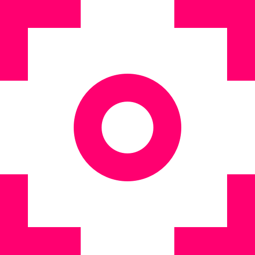

# 🎓 "Сложно сосредоточиться" - учебный проект

    

**🤖 Технологии:**  

  
  

**🛠 Основные решения:**  
- Адаптивная и резиновая верстка (mobile-first подход)  
- Кастомные CSS-переменные (Custom Properties)  
- Система переключения светлой/тёмной темы  
- Медиазапросы (@media) для адаптивного дизайна  
- Современные единицы измерения (vw, rem, clamp) 

**🚀 Запуск:**  
Откройте `index.html` в браузере или через Live Server в VS Code
